# 🗺️ Map Workflow Automation

A fully automated workflow for map processing, validation, and optimization. This repository implements a set of rules, checks, and optimizations based on governance guidelines to ensure maps meet specific criteria. It's designed to streamline the workflow for managing, validating, and optimizing maps for King of Gores maps.

## 🔄 How It Works

### For Contributors

When you submit a map to the [kog-teeworlds/maps](https://github.com/kog-teeworlds/maps) repository:

1. **Create a Pull Request** - Add or modify map files in the repository
2. **Automated Testing** - This workflow automatically runs compliance checks on your maps
3. **Review Results** - Check the workflow output for any validation errors or warnings
4. **Fix Issues** - If tests fail, address the reported violations and push updates
5. **Approval** - Once all checks pass, your PR can be reviewed and merged

```mermaid
graph TD
    A[Create PR on kog-teeworlds/maps] --> B[Workflow Triggers Automatically]
    B --> C[Download Changed Maps]
    C --> D[Run Validation Rules]
    D --> E{All Checks Pass?}
    E -->|Yes| F[✅ PR Ready for Review]
    E -->|No| G[❌ Show Violations]
    G --> H[Fix Issues in PR]
    H --> B
    F --> I[Maintainer Reviews]
    I --> J[Merge to Main]
```



### For Testers & Maintainers

After updating compliance rules, you can re-test existing maps:

1. **Update Rules** - Modify rule definitions in `map_rules/` directory
2. **Trigger Workflow** - Manually run the workflow on the maps repository
3. **Review Results** - Check if existing maps still comply with new rules
4. **Address Issues** - Create issues or PRs for maps that need updates

```mermaid
graph TD
    A[Update Compliance Rules] --> B[Commit to maps-workflow]
    B --> C[Manual Workflow Trigger on maps repo]
    C --> D[Validate All Maps]
    D --> E{All Maps Compliant?}
    E -->|Yes| F[✅ Rules Applied Successfully]
    E -->|No| G[📋 Generate Report]
    G --> H[Create Issues for Non-Compliant Maps]
    H --> I[Map Authors Fix Issues]
    I --> J[Submit PRs]
```



### Workflow Integration

```mermaid
sequenceDiagram
    participant User
    participant PR as Pull Request
    participant GH as GitHub Actions
    participant Workflow as Map Workflow
    participant Maps as Maps Repository

    User->>PR: Create/Update PR with maps
    PR->>GH: Trigger on push/PR
    GH->>Workflow: Run validation action
    Workflow->>Workflow: Load rules & dependencies
    Workflow->>Workflow: Execute checks on maps
    Workflow->>GH: Report results
    GH->>PR: Post check status & comments
    alt Tests Pass
        PR->>User: ✅ Ready for review
    else Tests Fail
        PR->>User: ❌ Fix violations
        User->>PR: Push fixes
        PR->>GH: Re-trigger workflow
    end
```



## ✨ Features

- 🔍 **Automated Map Validation**: Ensures maps adhere to predefined rules and governance policies
- ⚡ **Optimization**: Improves file size and structure
- 📜 **Governance-Based Rules**: Customizable rules for specific governance models
- 🛠️ **Error Reporting**: Provides detailed reports on failed validation checks with suggestions for fixes
- 🔗 **Modular Design**: Easily extendable to include additional validation or optimization logic
- 🚀 **CI/CD Integration**: Ready for GitHub Actions workflow

## 📋 Requirements

- Python 3.12+
- [uv](https://github.com/astral-sh/uv) package manager (recommended)

## 🚀 Installation

### Using pip

```bash
pip install git+https://github.com/kog-teeworlds/maps-workflow.git
```

### Local Development Installation

```bash
# Clone the repository
git clone https://github.com/kog-teeworlds/maps-workflow.git
cd maps-workflow

# Create virtual environment and install dependencies
python -m venv .venv
source .venv/bin/activate  # On Windows: .venv\Scripts\activate
pip install -e .
```

### Using uv (recommended)

```bash
# Clone the repository
git clone https://github.com/kog-teeworlds/maps-workflow.git
cd maps-workflow

# Install with uv
uv venv
uv pip install -e .
```

## 🔧 Usage

### Command Line Interface

The package provides a command-line interface for validating maps:

```bash
# Basic usage
mapcheck check path/to/your/map.map

# Specify output format
mapcheck check path/to/your/map.map --format markdown

# Save output to a file
mapcheck check path/to/your/map.map --output results.md

# Skip certain rule types
mapcheck check path/to/your/map.map --skip 001_,002_

# List all available rules
mapcheck list-rules
```

### Python API

```python
from maps_workflow.config.loader import ConfigLoader
from maps_workflow.core.engine import RuleEngine

# Load rule configurations
config_loader = ConfigLoader()
rules = config_loader.load_all_rules("path/to/rules")
dependencies = config_loader.get_rule_dependencies(rules)

# Create and run the engine
engine = RuleEngine()
result = engine.execute_workflow("path/to/map.map", rules, dependencies)

# Process results
print(f"Validation {'succeeded' if result.success else 'failed'}")
for rule_name, rule_result in result.rule_results.items():
    print(f"{rule_name}: {rule_result.status}")
```

### GitHub Actions

To use as a GitHub Action in your workflow:

```yaml
name: Validate Maps

on:
  push:
    paths:
      - '**.map'
  pull_request:
    paths:
      - '**.map'

jobs:
  validate:
    runs-on: ubuntu-latest
    steps:
      - uses: actions/checkout@v4

      - name: Validate maps
        uses: kog-teeworlds/maps-workflow@main
        with:
          maps: "path/to/map1.map,path/to/map2.map"
          action: check
          GITHUB_TOKEN: ${{ secrets.GITHUB_TOKEN }}
          GITHUB_REPOSITORY: ${{ github.repository }}
```

## 📝 Rule Definition

Rules are defined in YAML files in the `map_rules` directory. Each rule specifies:

- `name`: Name of the rule
- `module`: Python module implementing the rule
- `class_name`: Class name that implements the rule
- `description`: Description of what the rule checks
- `type`: Rule type (require, fail, skip)
- `depends_on`: List of rules this rule depends on
- `params`: Parameters for the rule

Example rule definition:

```yaml
rules:
  - name: Check max allowed file size
    module: rules.file
    class_name: FileSize
    description: "Check if size is allowed"
    type: require
    params:
      max_file_size: 10MB
    depends_on: []
```

## ⚙️ Custom Rules

You can create custom rules by:

1. Creating a Python class that inherits from `BaseRule`
2. Implementing the required methods
3. Adding a YAML configuration

Example custom rule:

```python
from maps_workflow.rules.base import BaseRule, BaseRuleParams
from maps_workflow.core.models import Violation
from pydantic import Field

class MyRuleParams(BaseRuleParams):
    my_parameter: str = Field(..., description="A parameter for my rule")

class MyRule(BaseRule):
    @classmethod
    def get_params_model(cls):
        return MyRuleParams

    def evaluate(self):
        # Implementation logic
        if some_condition:
            return [Violation(message="Validation failed", details={})]
        return []

    def explain(self):
        return f"Checks for {self.params.my_parameter}"
```

## 🤝 Contributing

Contributions are welcome! Please feel free to submit a Pull Request.

1. Fork the repository
2. Create your feature branch (`git checkout -b feature/amazing-feature`)
3. Commit your changes (`git commit -m 'Add some amazing feature'`)
4. Push to the branch (`git push origin feature/amazing-feature`)
5. Open a Pull Request

## 📄 License

This project is licensed under the GNU Affero General Public License v3.0 - see the [LICENSE](LICENSE) file for details.
